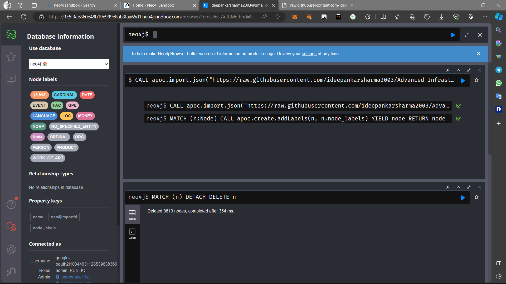
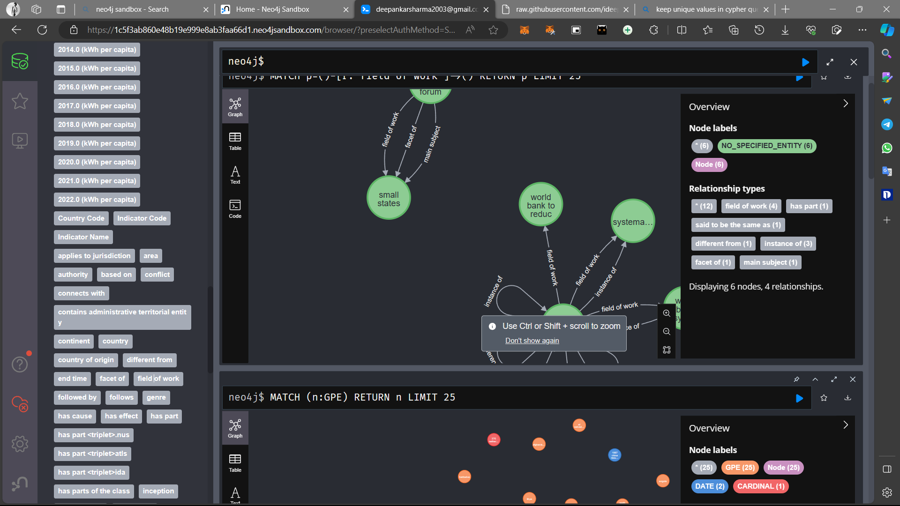
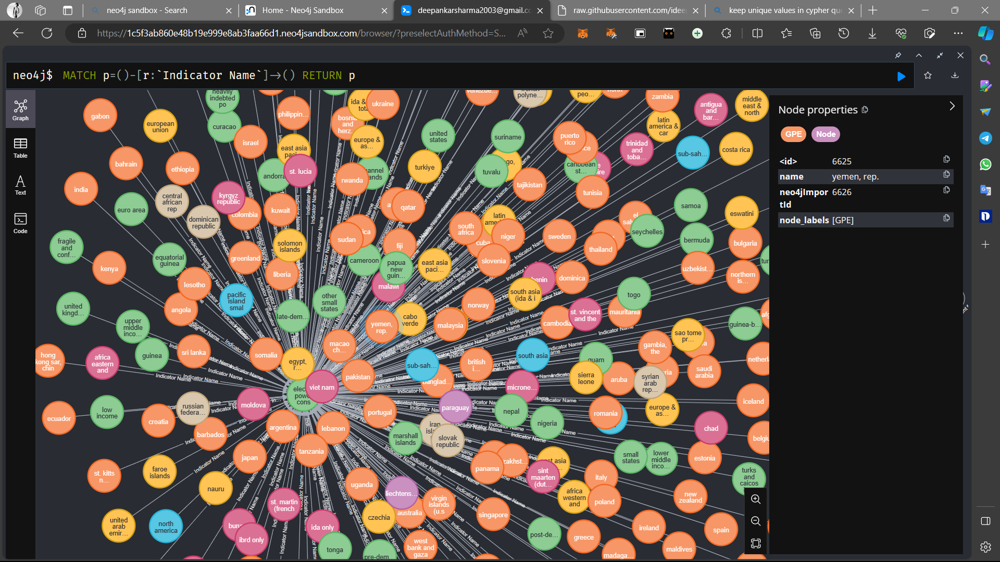

#  **Advanced Infrastructure Projects Data Analysis with Entity Relationship Mapping**

## Electric Power Consumption (kWh per capita)
#### `Dataset`: [Electric power consumption (kWh per capita)](https://data.worldbank.org/indicator/EG.USE.ELEC.KH.PC)


#### Workflows

1. Extracting the Entities from the Dataset using tabular data.
2. Extracting the Entities from the Metadata using Language Model `Babelscape/rebel-large`
3. The code walkthrough is in the research folder.
4. The extracted entities and the defined SVO triplets are in the Entities Library.

`Note`: Spacy is used for the NER of the extracted entities. However given more resources this could be done using custom finetuned NER model.

### Handy Cypher Commands 
```sql
CALL apoc.import.json("https://raw.githubusercontent.com/ideepankarsharma2003/KnowledgeGraphs/main/json_files/svo_new_cat_ear_headphones_deduped.json") ;


MATCH (n:Node) 
CALL apoc.create.addLabels(n, n.node_labels) 
YIELD node 
RETURN node;

MATCH (n) RETURN n;

MATCH (n) DETACH DELETE n;

```

## Graph Demo on Neo4j

- Labelled entities


- Extracted Relationships


- In-Depth Relationships



#### Director Guide

- [Code Walkthrough](research/)
- [Entity Extraction using Language Model](research/02_creatingSVO_triples.ipynb)
- [Final Generated Entities Guide](Entities/final_extracted_entities.json)
- [Labelling the SVO triples](research/04_knowledge_graph_node_labelling.ipynb)


#### Data Sources

● World Bank Projects<br>
● SAM.gov tenders<br>
● Multi-modal data (images, videos, and textual descriptions)<br>


<!-- 1. Update config.yaml
2. Update secrets.yaml [optional]
3. Update params.yaml 
4. Update the entity
5. Update the configuration manager in src/config
6. Update the components
7. Update the pipeline
8. Update the main.py
9. Update the dvc.yaml MLops tool to keep track of the CI/CD pipeline -->